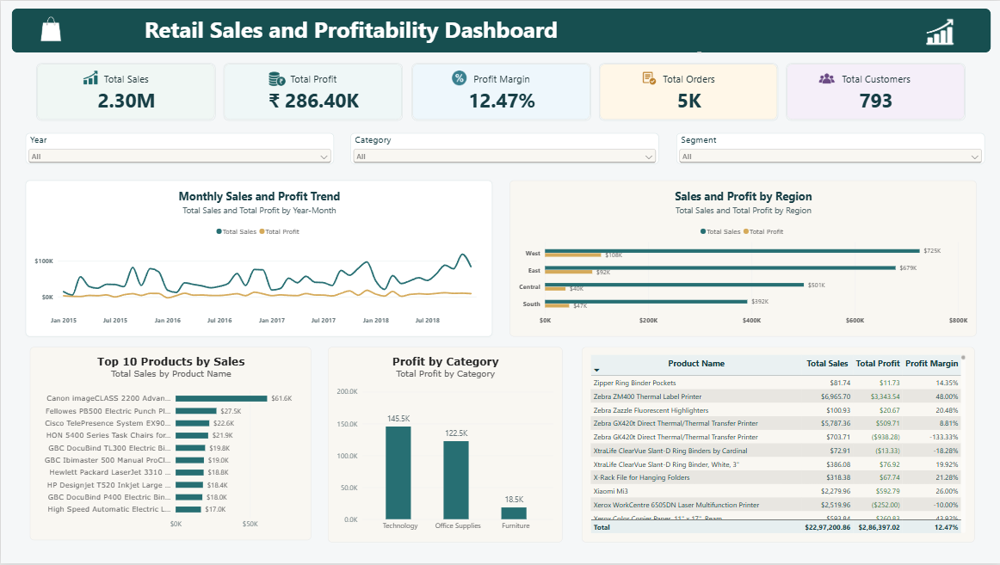

# Retail Sales and Profitability Analysis

## Project Overview

This project analyzes retail sales data to understand overall sales performance, profitability, product performance, category performance, regional trends, and customer behavior.

The project was completed as part of my Data Analyst portfolio and demonstrates an end-to-end analytics workflow: data preparation, Excel analysis, Power BI dashboard development, and business insight generation.

## Business Objective

The objective was to answer the following business questions:

- What are the total sales, total profit, profit margin, order count, and customer count?
- Which product category generates the highest sales and profit?
- Which region has the strongest and weakest performance?
- Which products are the top sellers?
- Which products generate losses?
- How do sales and profit change over time?
- What business actions could improve profitability?

## Tools Used

- Microsoft Excel: Data checking, calculated columns, PivotTables, charts, sorting, and filtering
- Power BI: Interactive dashboard, DAX measures, slicers, and visual analysis
- DAX: Measures for sales, profit, orders, customers, profit margin, and average order value

## Dataset

Sample Superstore retail dataset containing order-level information for products, customers, sales, quantity, discount, profit, category, region, and shipping details.

## Data Preparation

The following data preparation steps were completed:

- Checked the dataset for missing values
- Reviewed duplicate records
- Verified date, numeric, and text data types
- Created calculated columns:
  - Year
  - Month
  - Year-Month
  - Profit Margin
  - Shipping Days

## Power BI Dashboard

The dashboard includes:

- KPI cards for Total Sales, Total Profit, Profit Margin, Total Orders, and Total Customers
- Monthly Sales and Profit Trend
- Profit by Category
- Sales and Profit by Region
- Top 10 Products by Sales
- Product Performance table
- Conditional formatting to identify loss-making products
- Interactive slicers for Year, Category, and Customer Segment

## DAX Measures

```DAX
Total Sales = SUM(SalesData[Sales])

Total Profit = SUM(SalesData[Profit])

Total Quantity = SUM(SalesData[Quantity])

Total Orders = DISTINCTCOUNT(SalesData[Order ID])

Total Customers = DISTINCTCOUNT(SalesData[Customer ID])

Profit Margin = DIVIDE([Total Profit], [Total Sales], 0)

Average Order Value = DIVIDE([Total Sales], [Total Orders], 0)
```

## Key Insights

- Total sales was 2.30M.
- Total profit was ₹286.40K.
- The overall profit margin was 12.47%.
- Technology was the highest-sales category and the most-profitable category.
- Furniture showed the weakest profitability among the product categories.
- West was the highest-performing region by both sales and profit.
- South required further attention because it had the lowest sales and profit among the regions.
- The Canon imageCLASS 2200 Advanced Copier was the top-selling product, generating approximately $61.6K in sales.
- Sales and profit showed an overall upward trend over time, with monthly fluctuations.
- The most loss-making product was Cubify CubeX 3D Printer Double Head Print and ₹-8879.97.

## Business Recommendations

- Review loss-making products to assess pricing, discounts, and operational costs.
- Prioritize marketing and inventory planning for high-profit products, categories, and regions.
- Investigate the causes of lower profitability in Furniture and the South region.
- Track sales and profit together because high revenue does not always lead to high profitability.
- Monitor discount levels and their relationship with profitability before changing discount policies.

## Dashboard Preview



## Project Files

- `superstore_cleaned.xlsx` — Cleaned dataset
- `retail_sales_analysis.xlsx` — Excel analysis with PivotTables and charts
- `retail_sales_dashboard.pbix` — Power BI interactive dashboard
- `Dashboard.png` — Dashboard screenshot

## Author

**Princy Vinofer V**  
Aspiring Data Analyst  
Skills: Excel | Power BI | DAX | Data Cleaning | Data Visualization
